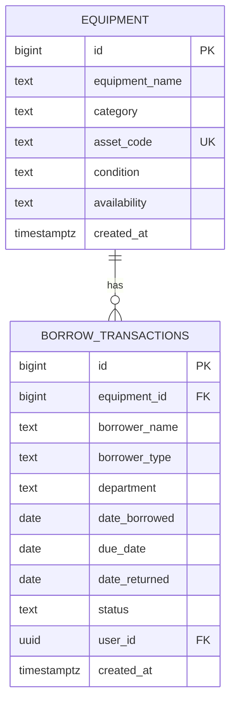

# Entity Relationship Diagram

```mermaid
erDiagram
 EQUIPMENT ||--o{ BORROW_TRANSACTIONS : has
 EQUIPMENT {
  bigint id PK
  text equipment_name
  text category
  text asset_code UK
  text condition
  text availability
  timestamptz created_at
 }
 BORROW_TRANSACTIONS {
  bigint id PK
  bigint equipment_id FK
  text borrower_name
  text borrower_type
  text department
  date date_borrowed
  date due_date
  date date_returned
  text status
  uuid user_id FK
  timestamptz created_at
 }
```

One equipment item may have multiple borrowing records over time. Each borrowing transaction references exactly one equipment item.